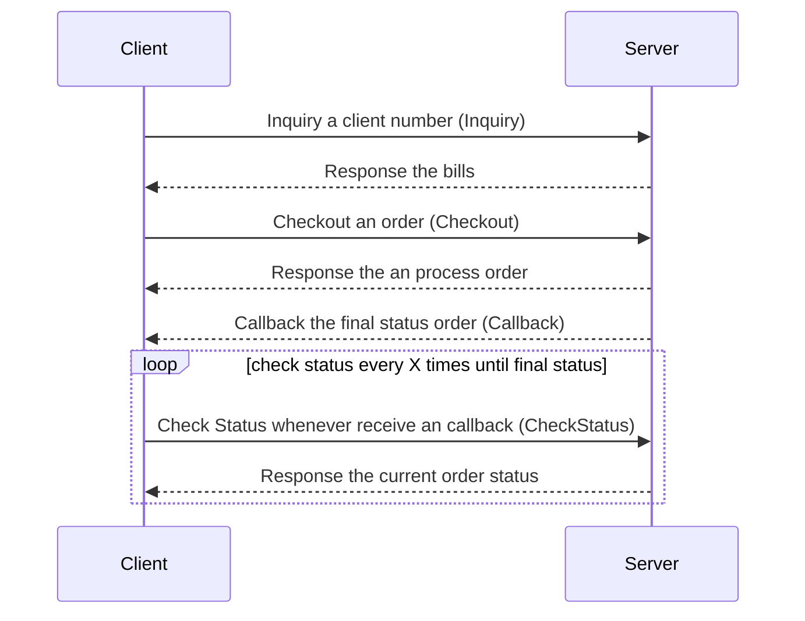
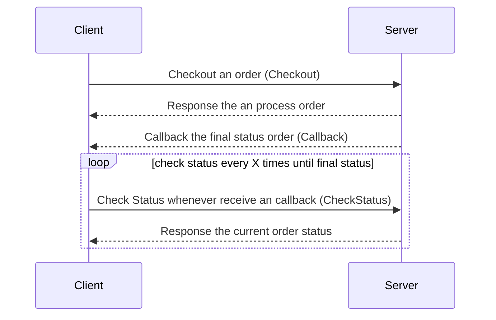

### Golang SDK SAT
The client integration experience is our priority. 
This SDK will be a realization from our dedication to give the best service to our client.

#### High Level Diagram
##### Inquiry Product


##### Non Inquiry Product


#### Prerequisite
- Golang >= 1.18
- Tokopedia Account registered as Distributor SAT, please follow **DG B2B - Developer Guideline**
- Generate Pair Private Key & Public Key, you can follow **API Documentation Section 2.4 Digital Signature**
- Share your Public Key to [Tokopedia Dev Console](https://developer.tokopedia.com/console/apps) under your current apps. We recommend starting from testing apps.


#### Install Library
Since this SDK still on development stage, you can install the library by using this command.
```
go get github.com/tokopedia/digital-b2b-client-library/golang-sat@master
```


#### Init SDK
Below basic implementation to use the SDK. 
```go
package main

import (
	"context"
	"fmt"
	"net/http"
	"time"

	"github.com/tokopedia/digital-b2b-client-library/golang-sat"
	"github.com/tokopedia/digital-b2b-client-library/golang-sat/signature"
)

func main() {
	c := &http.Client{
		Timeout: 30 * time.Second,
	}

	cln, err := sat.NewClient(
		"CLIENT_ID",
		"CLIENT_SECRET",
		"PRIVATE_KEY",
		sat.WithServerPublicKeyString("PUBLIC_KEY"),
		sat.WithPaddingType(signature.PaddingTypePSS),
		sat.WithIsDebug(true),
		sat.WithHTTPClient(c),
	)
	if err != nil {
		panic(err)
	}

	res, err := cln.Ping(context.TODO())
	if err != nil {
		panic(err)
	}

	fmt.Println(res)
}

```
Use **sat.WithSatBaseURL** to override SAT Base URL when you move to another environment.
Example production environment you can use https://b2b.tokopedia.com/api as the SAT Base URL.

```go
package main

import (
	"context"
	"fmt"
	"net/http"
	"time"

	"github.com/tokopedia/digital-b2b-client-library/golang-sat"
	"github.com/tokopedia/digital-b2b-client-library/golang-sat/signature"
)

func main() {
	c := &http.Client{
		Timeout: 30 * time.Second,
	}

	cln, err := sat.NewClient(
		"CLIENT_ID",
		"CLIENT_SECRET",
		"PRIVATE_KEY",
		sat.WithServerPublicKeyString("PUBLIC_KEY"),
		sat.WithPaddingType(signature.PaddingTypePSS),
		sat.WithIsDebug(true),
		sat.WithHTTPClient(c),
		sat.WithSatBaseURL("https://b2b.tokopedia.com/api"),
	)
	if err != nil {
		panic(err)
	}

	res, err := cln.Ping(context.TODO())
	if err != nil {
		panic(err)
	}

	fmt.Println(res)
}
```

#### Ping
This method allows you to check SAT server health 
```go
res, err := cln.Ping(context.TODO())
```

#### Account
Account method used to check current your account balance. 
This will help you to monitor your account balance. 
You can utilize this function to prevent it from insufficient balance.
```go
resAccount, err := cln.Account(ctx)
```

#### Inquiry
Inquiry method mostly used to check a user bill for a product inquiry type
```go
resInq, err := i.client.Inquiry(ctx, &sat.InquiryRequest{
    ProductCode:  "pln-prepaid-token-50k-sat",
    ClientNumber: "102111106111",
})
```

#### Checkout
Checkout allows your system to post the order to SAT server. It means the order will be processed, and your balance will be deducted. 
The process will be asynchronous, so you required to implement Check Status to get the final order status.
```go
resOrder, err := i.client.Checkout(ctx, &sat.OrderRequest{
    ProductCode:  "pln-prepaid-token-100k",
    ClientNumber: "102111106111",
    RequestID:    "request_id_unique_identifier",
})
```

#### Check Status
Check Status will return the current order status and the detail order information. Please follow our API Doc to handle each error code.

```go
resOrderDetail, err := i.client.CheckStatus(ctx, "request_id_unique_identifier")
```

##### Handle Error Code From Order Status Failed
Order Status "Failed" always exposes error code. You can refer to our **API Documentation Section 4.8 Error Response** to handle each error code.
Below snipped code is the example of how you can handle the error code.
```go
if resOrderDetail != nil && resOrderDetail.Status == "Failed" {
    switch resOrderDetail.ErrorCode {
    case "S00":
        // do something
    case "P00":
        // do something
    case "U00":
        // do something
    }
}
```


#### List Product
List product will return all products that are available or specific product when you pass the product code on the parameter.
```go
resProductList, err := i.client.ListProduct(ctx, "pln-prepaid-token-50k-sat")
```


#### Callback
Client need to expose the Webhook using HTTP Server and implement the Handler using Callback interface.
Callback will help you to get the final status order real time based on the event via triggered from webhook.

```go
package main

import (
	"context"
	"fmt"

	"github.com/tokopedia/digital-b2b-client-library/golang-sat"
)

type callbackExample struct{}

func (c *callbackExample) Do(ctx context.Context, request *sat.OrderDetail) error {
	fmt.Println("CALLBACK Payload: ", request)
	// Do something
	return nil
}
```

### Handle Error
This SDK applied standard error payload that always provides error code, error detail, and http status.
Detail error handling each error code will be mentioned in our **API Documentation Section 4.8 Error Response**.
```go
var errR sat.APIResponseError
ok = errors.As(err, &errR)
if ok {
    fmt.Println("error: ", errR.Error())
    // handle the error
    // read the documentation
    switch errR.Code() {
    case "S00":
        // do something
    case "P00":
        // do something
    case "U00":
        // do something
    }
}

```
Internal error is an error coming from non sat server, example: firewall, proxy, client http, etc.
You can parse the http response by yourself and handle it based on your need.
Most of the time you only need to use the http statusCode and handle it. 

```go
var errR sat.APIInternalError
ok = errors.As(err, &errR)
if ok {
    fmt.Println("error: ", errR.Error())
    // handle the error
    // read the documentation
    httpResp := errR.Response()
    // Do something with raw http response 
    switch httpResp.StatusCode {
    case 408:
        // do something
    case 403:
        // do something
    case 429:
        // do something 
    }
}

```

### Full Example
Please check on the example folder to see the full implementation for each method.


### License
The MIT License (MIT)

Copyright (c) 2024 Tokopedia

Permission is hereby granted, free of charge, to any person obtaining a copy of this software and associated documentation files (the "Software"), to deal in the Software without restriction, including without limitation the rights to use, copy, modify, merge, publish, distribute, sublicense, and/or sell copies of the Software, and to permit persons to whom the Software is furnished to do so, subject to the following conditions:

The above copyright notice and this permission notice shall be included in all copies or substantial portions of the Software.

THE SOFTWARE IS PROVIDED "AS IS", WITHOUT WARRANTY OF ANY KIND, EXPRESS OR IMPLIED, INCLUDING BUT NOT LIMITED TO THE WARRANTIES OF MERCHANTABILITY, FITNESS FOR A PARTICULAR PURPOSE AND NONINFRINGEMENT. IN NO EVENT SHALL THE AUTHORS OR COPYRIGHT HOLDERS BE LIABLE FOR ANY CLAIM, DAMAGES OR OTHER LIABILITY, WHETHER IN AN ACTION OF CONTRACT, TORT OR OTHERWISE, ARISING FROM, OUT OF OR IN CONNECTION WITH THE SOFTWARE OR THE USE OR OTHER DEALINGS IN THE SOFTWARE.
